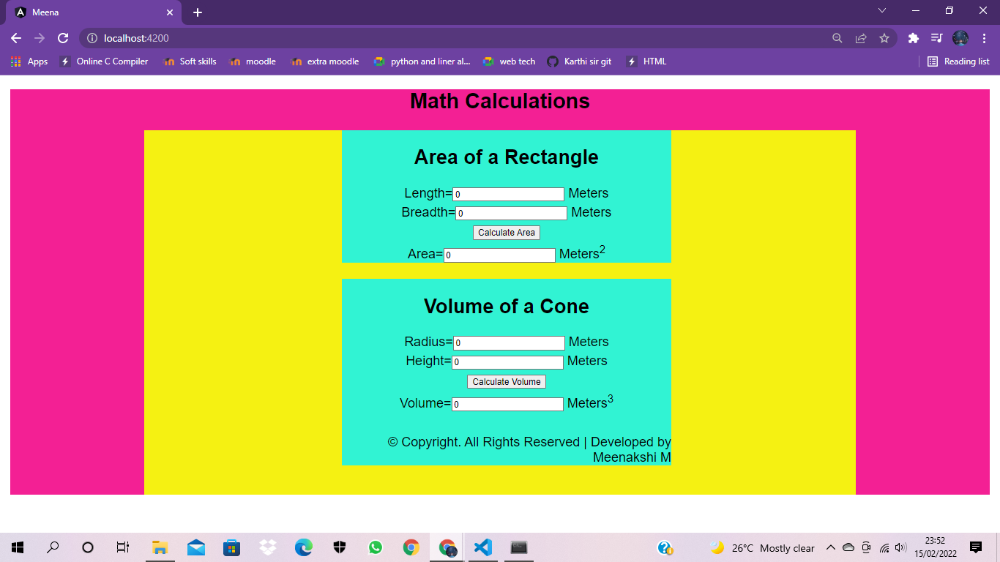

# AngularCalculation

# Web Page for Mathematical Calculations using Angular

## AIM:
To design a dynamic website to perform mathematical calculations using Angular Framwork

## DESIGN STEPS:

### Step 1:

Requirement collection.

### Step 2:

Creating the layout using HTML and CSS in component.html file

### Step 3:

Write typescript to perform the calculations.

### Step 4:

Validate the layout in various browsers.

### Step 5:

Validate the HTML code.

### Step 6:

Publish the website in the given URL.

## PROGRAM :
### app.component.html code:
~~~
<body>
    <h1>Math Calculations</h1>
    

    

    <Rectanglr-Area></Rectanglr-Area>
    

    

    <Cone-Volume></Cone-Volume>
    

        &copy; Copyright. All Rights Reserved | Developed by Meenakshi M
      

    

    

</body>
~~~
### app.component.css code:
~~~
* {
    box-sizing:border-box;
    font-family: Arial, Helvetica, sans-serif;
  }
  body {
    background-color:rgb(243, 32, 148);
  }
  .container {
    width:1080px;
    margin-left: auto;
    margin-right: auto;
    padding-left: 300px;
    max-height:max-content;
    background-color:rgb(245, 241, 18);
    padding-bottom: 45px; ;
  }
  .content {
    display:block;
    width: 500px;
    background-color:rgb(49, 243, 211);
    min-height: 150px;
    font-size: 20px;
    position:relative;
    
  }
  h1{
    text-align: center;
    color:black;
  }
  
  .footer {
    display: inline-block;
    width: 100%;
    height: 40px;
    background-color:rgb(49, 243, 211);
    text-align:right;
    padding-top: 30px;
    margin: 0px 0px 0px 0px;
    color: #000000;
  }
  ~~~
  ### app.component.ts code:
  ~~~
  import { Component } from '@angular/core';

@Component({
  selector: 'app-root',
  templateUrl: './app.component.html',
  styleUrls: ['./app.component.css']
})
export class AppComponent {
  title = 'mathcalculations';
}
~~~
### rectangle.component.html code:
~~~
<h2>Area of a Rectangle</h2>
    

    Length=<input type="text" [(ngModel)]="length"> Meters  
    

    

    Breadth=<input type="text" [(ngModel)]="breadth"> Meters  
    

    

        <input type="button" (click)="onCalculate()" value="Calculate Area">  
    

    

    Area=<input type="text" [value]="area"> Meters2
    

~~~
### rectangle.component.css code:
~~~
* {
    box-sizing: border-box;
    font-family: Arial, Helvetica, sans-serif;
  }
  .container {
    width: 1080px;
    margin-left: auto;
    margin-right: auto;
    padding-top: 30px;
    padding-left: 300px;
    padding-bottom: 500px;
  }
  .content {
    display:block;
    width: 500px;
    background-color:white;
    min-height: 150px;
    font-size: 20px;
  }
  h2{
      text-align: center;
      padding-top: 25px;
  }
  .formelement{
      text-align: center;
      margin-top: 5px;
      margin-bottom: 5px;
  }
~~~
### rectangle.component.ts code:
~~~
import { Component } from "@angular/core"

@Component({
    selector: 'Rectanglr-Area',
    templateUrl:'./rectangle.component.html',
    styleUrls:['./rectangle.component.css']
})
export class RectangleComponent{
    length:number;
    breadth:number;
    area:number;
    constructor(){
        this.length=0;
        this.breadth=0;
        this.area =this.length * this.breadth;

    }
    onCalculate()
    {
        this.area =  this.length * this.breadth;
    }
}
~~~
### cone.component.html code:
~~~
<h2>Volume of a Cone</h2>

Radius=<input type="text" [(ngModel)]="radius"> Meters  

Height=<input type="text" [(ngModel)]="height"> Meters  

    <input type="button" (click)="onCalculate()" value="Calculate Volume">  

Volume=<input type="text" [value]="volume"> Meters3

~~~
### cone.component.css code:
~~~
* {
    box-sizing: border-box;
    font-family: Arial, Helvetica, sans-serif;
  }
  h2{
      text-align: center;
      padding-top: 25px;
  }
  .formelement{
      text-align: center;
      margin-top: 5px;
      margin-bottom: 5px;
  }
~~~
### cone.component.ts code:
~~~
import { style } from "@angular/animations";
import { Component } from "@angular/core"

@Component({
    selector: 'Cone-Volume',
    templateUrl:'./cone.component.html',
    styleUrls:['./cone.component.css']

})
export class ConeComponent{
    radius:number;
    height:number;
    volume:number;
    constructor(){
        this.radius=0;
        this.height=0;
        this.volume =3.14 * this.radius * this.radius * this.height * 0.3;
        
    }
    onCalculate()
    {
        this.volume = 3.14 * this.radius * this.radius * this.height * 0.3;
    }
}
~~~
### app.module.ts code:
~~~
import { NgModule } from '@angular/core';
import { FormsModule } from '@angular/forms';
import { BrowserModule } from '@angular/platform-browser';

import { AppComponent } from './app.component';
//import { RectangleComponent } from './rectangle/rectangle.component';
import { ConeComponent } from './cone.component';
//import { ConeComponent } from './cone/cone.component';
//import { RectangleComponent } from './Rectangle/Rectangle.component';
import { RectangleComponent } from './rectangle.component';
//import { RectangleComponent } from './rectangule/rectangule.component';

@NgModule({
  declarations: [
    AppComponent,RectangleComponent,ConeComponent
  ],
  imports: [
    BrowserModule,FormsModule,
  ],
  providers: [],
  bootstrap: [AppComponent]
})
export class AppModule { }
~~~
## OUTPUT:
### Home Page:

### Values entered home page:

## Result:
Thus a Mathmetical Calculation website is created using Angular.
